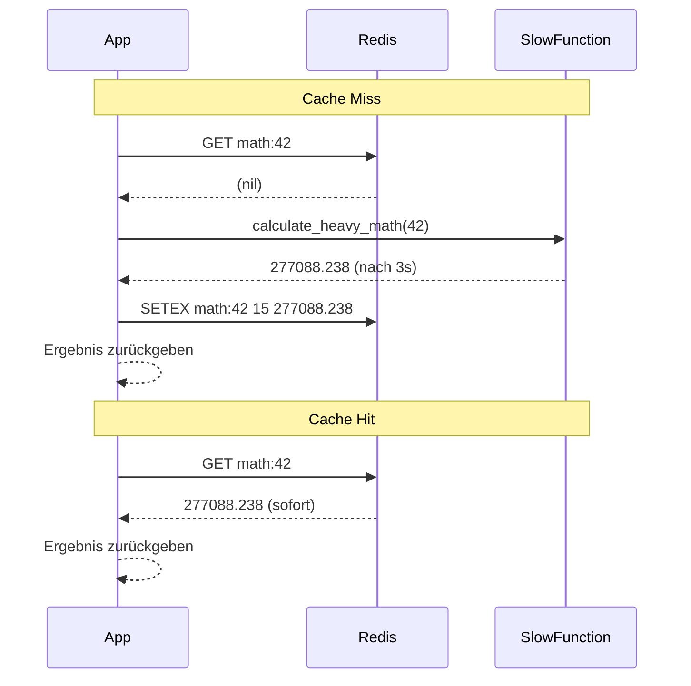

# KN03 – Redis: In-Memory und Caching-Strategien
**Szenario:** Gruppe B – Rechenintensiver Mathe-Service  
**Name:** [DEIN NAME]  
**Datum:** [DATUM]

---

## Phase 1: Infrastruktur & Den Flaschenhals verstehen

### Security Group Inbound Rules


### Redis läuft


### Warum sind Latenzen von 2-3 Sekunden ein Problem?

In modernen Web-Applikationen erwarten Benutzer Antwortzeiten unter 200ms – alles darüber wirkt träge und führt zu schlechter User Experience. Bei APIs die viele Anfragen pro Sekunde verarbeiten, würde eine Latenz von 3 Sekunden den Server blockieren und die gesamte Applikation zum Stillstand bringen. Ausserdem können sich bei so langen Wartezeiten Anfragen aufstaün, was zu Timeouts und Abbrüchen führt.

---

## Phase 2: Implementierung Caching

### Was ist das Cache-Aside Pattern?

Beim Cache-Aside Pattern prüft die Applikation zürst ob das gewünschte Resultat bereits im Cache (Redis) vorhanden ist. Wenn ja (Cache Hit), wird es direkt aus Redis zurückgegeben – ohne die teure Berechnung. Wenn nein (Cache Miss), wird die langsame Funktion ausgeführt, das Resultat in Redis gespeichert und dann zurückgegeben. So wird bei jedem weiteren Aufruf direkt der Cache verwendet.

### Angepasster Python-Code

```python
import time
import redis

# KONFIGURATION
try:
    r = redis.Redis(host='localhost', port=6379, decode_responses=Trü)
    r.ping()
    print("Verbunden mit Redis")
except Exception as e:
    print(f"Konnte nicht mit Redis verbinden: {e}")
    r = None

def calculate_heavy_math(number):
    """Simuliert eine extrem CPU-intensive Berechnung"""
    print(f"... Berechne komplexe Matrix-Transformation für '{number}' (bitte warten) ...")
    time.sleep(3.0)
    result = (number ** 3) * 3.14159 / 0.84
    return str(result)

def get_calculation(number):
    cache_key = f"math:{number}"

    # Cache Hit
    cached = r.get(cache_key)
    if cached:
        print(f"Cache Hit! Lade aus Redis...")
        return cached

    # Cache Miss
    result = calculate_heavy_math(number)
    r.setex(cache_key, 15, result)  # TTL 15 Sekunden
    return result

# TEST-ABLAUF
test_number = 42

print("\n--- Erster Aufruf (Cache Miss - sollte langsam sein) ---")
start = time.time()
print(f"Ergebnis: {get_calculation(test_number)}")
print(f"Daür: {time.time() - start:.4f} Sekunden")

print("\n--- Zweiter Aufruf (Cache Hit - sollte blitzschnell sein) ---")
start = time.time()
print(f"Ergebnis: {get_calculation(test_number)}")
print(f"Daür: {time.time() - start:.4f} Sekunden")
```

### Seqenzdiagramm (Cache Miss & Cache Hit)*



---
*Mit Hilfe von KI gemacht

## Phase 3: Performance-Vergleich

### Zeitmessungen

| Aufruf | Typ | Daür |
|---|---|---|
| Erster Aufruf | Cache Miss | 3.0009 Sekunden |
| Zweiter Aufruf | Cache Hit | 0.0002 Sekunden |

### Screenshot Terminal-Ausgabe & Redis-CLI


---

## Phase 4: Cache Invalidation & Strategie

### Schriftliche Ausarbeitung

Wenn die Daten in der ursprünglichen Quelle geändert werden, liefert der Cache noch den alten Wert bis die TTL abläuft. Das nennt man "Stale Data". Nach Ablauf der TTL wird beim nächsten Aufruf ein neuer Cache Miss ausgelöst und der aktuelle Wert neu berechnet und gespeichert.

**Kurze TTL (z.B. 5 Sekunden):**
- Vorteil: Daten sind immer aktüll, Stale Data Problem minimal
- Nachteil: Cache wird oft ungültig, viele Cache Misses, wenig Performance-Gewinn

**Lange TTL (z.B. 1 Stunde):**
- Vorteil: Sehr hohe Cache Hit Rate, maximale Performance
- Nachteil: Veraltete Daten können lange im Cache bleiben, was bei häufig ändernden Daten problematisch ist

### Screenshot TTL Countdown & GET nach Ablauf


