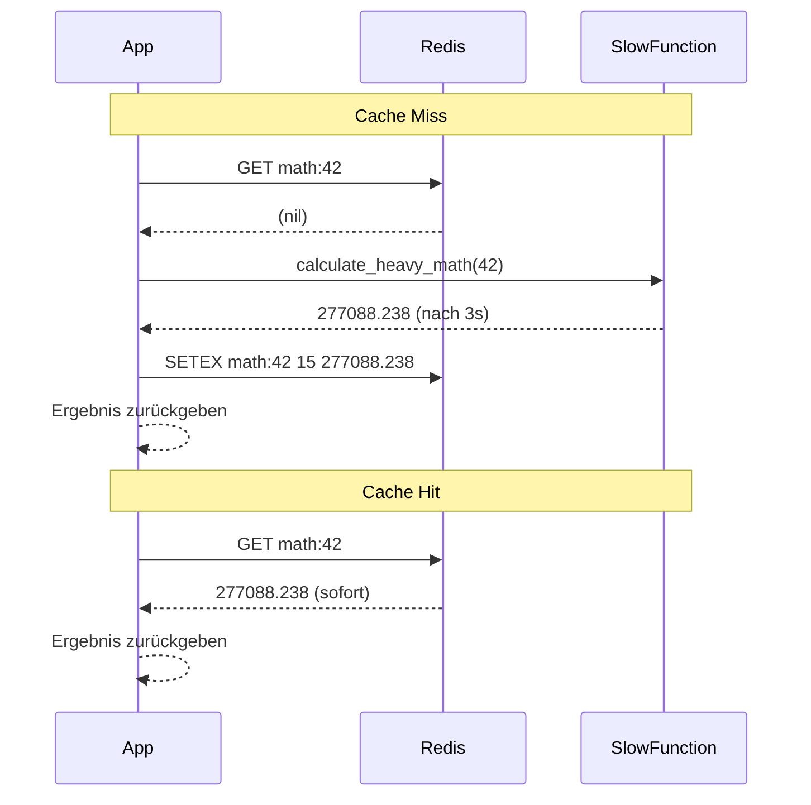

# KN03 – Redis: In-Memory und Caching-Strategien
**Szenario:** Gruppe B – Rechenintensiver Mathe-Service  
**Name:** [DEIN NAME]  
**Datum:** [DATUM]

---

## Phase 1: Infrastruktur & Den Flaschenhals verstehen

### Security Group Inbound Rules


### Redis läuft


### Warum sind Latenzen von 2-3 Sekunden ein Problem?

In modernen Web-Applikationen erwarten Benutzer Antwortzeiten unter 200ms – alles darueber wirkt traege und fuehrt zu schlechter User Experience. Bei APIs die viele Anfragen pro Sekunde verarbeiten, wuerde eine Latenz von 3 Sekunden den Server blockieren und die gesamte Applikation zum Stillstand bringen. Ausserdem koennen sich bei so langen Wartezeiten Anfragen aufstauen, was zu Timeouts und Abbruechen fuehrt.

---

## Phase 2: Implementierung Caching

### Was ist das Cache-Aside Pattern?

Beim Cache-Aside Pattern prueft die Applikation zuerst ob das gewuenschte Resultat bereits im Cache (Redis) vorhanden ist. Wenn ja (Cache Hit), wird es direkt aus Redis zurueckgegeben – ohne die teure Berechnung. Wenn nein (Cache Miss), wird die langsame Funktion ausgefuehrt, das Resultat in Redis gespeichert und dann zurueckgegeben. So wird bei jedem weiteren Aufruf direkt der Cache verwendet.

### Angepasster Python-Code

```python
import time
import redis

# KONFIGURATION
try:
    r = redis.Redis(host='localhost', port=6379, decode_responses=True)
    r.ping()
    print("Verbunden mit Redis")
except Exception as e:
    print(f"Konnte nicht mit Redis verbinden: {e}")
    r = None

def calculate_heavy_math(number):
    """Simuliert eine extrem CPU-intensive Berechnung"""
    print(f"... Berechne komplexe Matrix-Transformation fuer '{number}' (bitte warten) ...")
    time.sleep(3.0)
    result = (number ** 3) * 3.14159 / 0.84
    return str(result)

def get_calculation(number):
    cache_key = f"math:{number}"

    # Cache Hit
    cached = r.get(cache_key)
    if cached:
        print(f"Cache Hit! Lade aus Redis...")
        return cached

    # Cache Miss
    result = calculate_heavy_math(number)
    r.setex(cache_key, 15, result)  # TTL 15 Sekunden
    return result

# TEST-ABLAUF
test_number = 42

print("\n--- Erster Aufruf (Cache Miss - sollte langsam sein) ---")
start = time.time()
print(f"Ergebnis: {get_calculation(test_number)}")
print(f"Dauer: {time.time() - start:.4f} Sekunden")

print("\n--- Zweiter Aufruf (Cache Hit - sollte blitzschnell sein) ---")
start = time.time()
print(f"Ergebnis: {get_calculation(test_number)}")
print(f"Dauer: {time.time() - start:.4f} Sekunden")
```

### Sequenzdiagramm (Cache Miss & Cache Hit)



---

## Phase 3: Performance-Vergleich

### Zeitmessungen

| Aufruf | Typ | Dauer |
|---|---|---|
| Erster Aufruf | Cache Miss | 3.0009 Sekunden |
| Zweiter Aufruf | Cache Hit | 0.0002 Sekunden |

### Screenshot Terminal-Ausgabe


### Screenshot Redis-CLI


---

## Phase 4: Cache Invalidation & Strategie

### Schriftliche Ausarbeitung

Wenn die Daten in der urspruenglichen Quelle geaendert werden, liefert der Cache noch den alten Wert bis die TTL ablaeuft. Das nennt man "Stale Data". Nach Ablauf der TTL wird beim naechsten Aufruf ein neuer Cache Miss ausgeloest und der aktuelle Wert neu berechnet und gespeichert.

**Kurze TTL (z.B. 5 Sekunden):**
- Vorteil: Daten sind immer aktuell, Stale Data Problem minimal
- Nachteil: Cache wird oft ungueltig, viele Cache Misses, wenig Performance-Gewinn

**Lange TTL (z.B. 1 Stunde):**
- Vorteil: Sehr hohe Cache Hit Rate, maximale Performance
- Nachteil: Veraltete Daten koennen lange im Cache bleiben, was bei haeufig aendernden Daten problematisch ist

### Screenshot TTL Countdown


### Screenshot GET nach Ablauf


